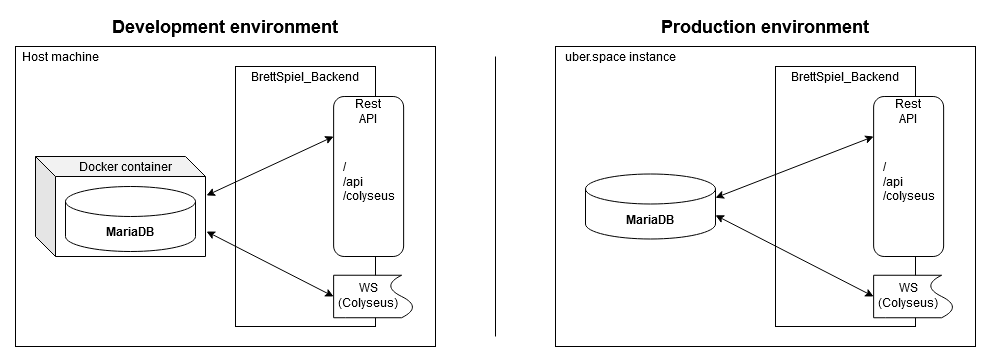

# BrettSpiel_Backend

Backend to host both CRUD operations for the databse via an HTTP-API and the Colyseus game server.
Running the server will require a running database for full functionallity. The Repository uses MariaDB which is supplied
through the docker container found under the docker directory.

### Environment


## Getting started


Running the backend requires docker. Install ```Docker Desktop``` for windows and ```docker``` on unix.

### Setup

You can set up the backend with the following command. It will create a `.env` file, a docker image of mariadb:lts and install all npm packages that you will need for the project.
```sh
npm run setup
```
### Run the project

In order to run the backend you need to start your created docker container and the backend itself. 
It is necessary that the docker container is running first.

Running the container (anywhere):
```sh 
docker run -p 3306:3306 mariadb:<tag number>
```

Access MariaDB inside the container:
Note: The root password is found in the ```<project root>/docker/Dockerfile```
```
exec -it <container id | container name> bash
mysql -u root -p
```

After starting the container, the MariaDB is accessable for external tools on 127.0.0.1:3306.

To start the backend use:
```sh
npm start
```


## Schema
The database schema is filled while you start the project. While starting, the database will be migrated automatically (in dev mode) with the files located in `/src/migrations`.
The files contain all information about previous changes, such as creating new tables, modifying existing tables, or dropping tables. And will execute them all.

# Contributing
This section deals with coding helps, remarks and auxiliary information.

### Logging
The new logging framework we added is used nearly identical to the normal logging we already did.
However, we are now able to use all log levels one would expect by calling the console like this:

````
console.debug('foo'); //  [11:46:35] [debug] foo
console.log('foo'); //    [11:46:35] [log] foo
console.info('foo'); //   [11:46:35] [info] foo
console.warn('foo'); //   [11:46:35] [warn] foo
console.error('foo'); //  [11:46:35] [error] foo
console.line('foo'); //   foo
````

Logs will now also be saved in a directory named ``logs``. At the moment this will need to be cleaned by hand.


